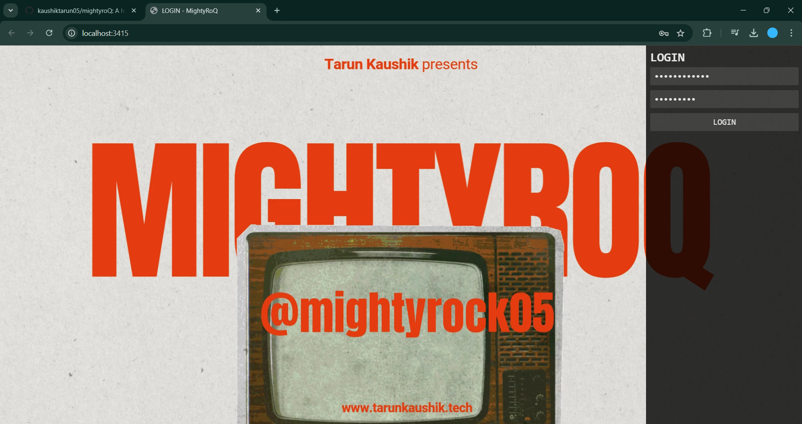
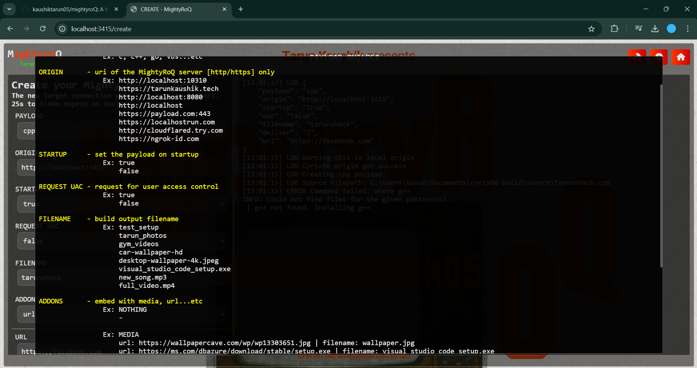
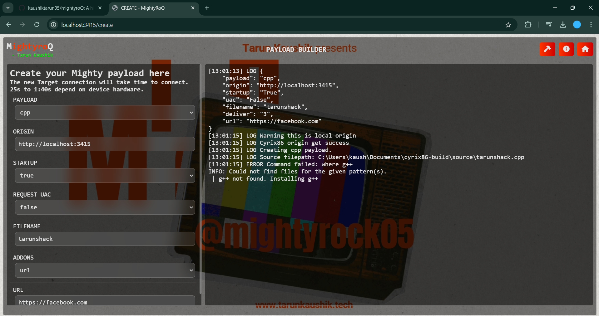

MightyroQ
=========

**MightyroQ** is a high-level Windows payload providing a fully GUI-based control panel for executing and managing various security operations. Designed for network security researchers and professionals, mightyroQ offers an intuitive interface to control and deploy payloads effectively within Windows environments.

* * * * *

Features
--------

-   Command Execution: Run commands through Cmd or PowerShell
-   Media Control: Capture screenshots, take webcam snapshots, start screen sharing, stream from webcam, and play audio
-   File Management: Upload, download, and manage files with a built-in file manager
-   System Interactions: Send notifications, display message boxes, control UAC, manage startup, and exit processes
-   Scripting & Package Management: Python script execution and package management via Pip
-   Additional Options: Track keystrokes, and more

* * * * *

Requirements
------------

Server

-   Node.js

Build Tools

-   GCC & G++
-   Go

Supported OS

-   Windows 10 (version 1803 or later, build 17063 or newer)

* * * * *

Installation
------------

1.  Clone the Repository

    `git clone https://github.com/yourusername/mightyroQ.git
    cd mightyroQ/`

2.  Install Dependencies

    `npm install`

3.  Start the Server

    `npm start`

4.  Add the Following Paths to Antivirus Exclusions

    `\path\to\mightyroQ\payloads
    \Users\tarun\Documents\`

5.  Access the Control Panel
    Open your browser and navigate to <http://localhost:3415>.

* * * * *

Usage
-----

Default Credentials

-   Username: tarunkaushik
-   Password: trunk123

To modify these credentials, edit the `./utils/config.js` file.

User Interface

-   UI: ui
-   Payload Build: build
-   Control Panel: panel

Control Panel Options

-   Cmd - Execute commands in the command prompt
-   Powershell - Execute PowerShell commands
-   Screenshot - Take screenshots of the active screen
-   Webcam Snapshot - Capture a single image from the webcam
-   ScreenShare - Share the screen in real-time
-   WebcamStream - Stream video from the webcam
-   Play Audio - Play audio on the target system
-   KeyStrokes - Capture keystrokes in real-time
-   Upload - Upload files to the target system
-   Download - Download files from the target system
-   Notification - Send notifications
-   Message Box - Display a custom message box
-   UAC - Manage UAC settings
-   Python - Execute Python scripts
-   Pip - Install Python packages via Pip
-   Startup - Add or remove startup entries
-   Exit - Terminate the session
-   Filemanager - Browse and manage files on the target system

* * * * *

Configuration
-------------

To customize settings, open `./utils/config.js` and adjust parameters as needed.

* * * * *

Disclaimer
----------

mightyroQ is intended for authorized security research and educational purposes only. Unauthorized use of this tool may be illegal and unethical. Use responsibly and with permission.
